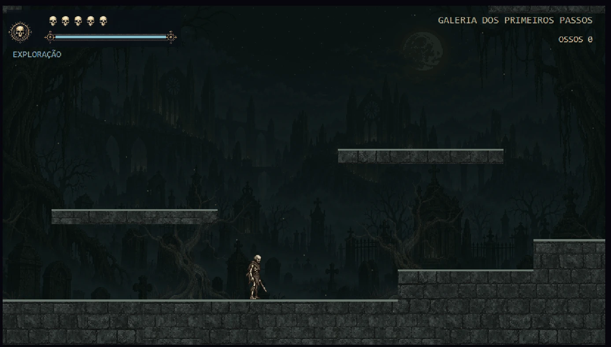
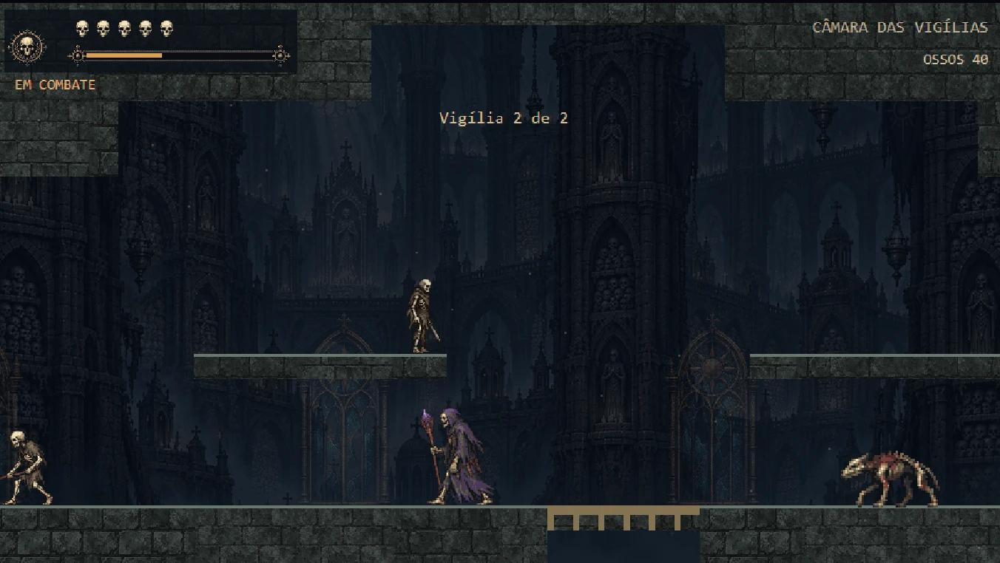
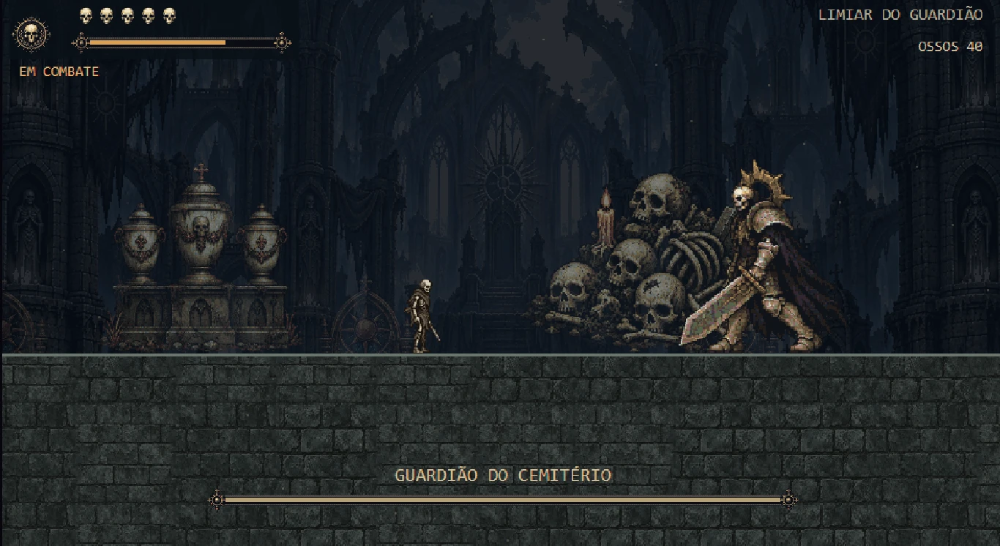
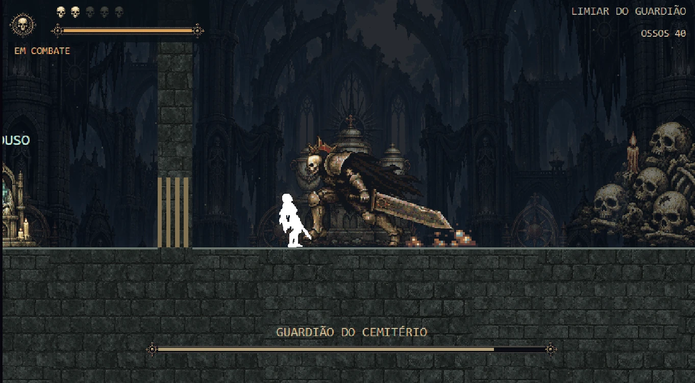

# Arauto do Sol (working title) — Cemetery demo v0.6.0

A 2D metroidvania — the genre the author has the most experience with — built with **HTML5, JavaScript ES Modules and Canvas 2D**: no engine, no build step, no external dependencies. Combat and progression draw on Hollow Knight; the show-don't-tell storytelling draws on Dark Souls. You play as a skeleton with no memory of who they were, piecing their past together while fighting bosses and other undead across an expanding world — full lore (the Herald of the Sun, three warring Moons, an absent god) is written out in `docs/GDD.md`.

This is the most worked-on project in this portfolio, and the one under active, ongoing development. This build is a vertical slice (v0.6.0): one biome (the Cemetery), core combat, exploration and audio are playable end to end, but it's not a finished game.

## Screenshots
*(in-engine captures, not final marketing art)*

| Exploration | Ambush |
|---|---|
|  |  |

| Boss reveal | Boss fight |
|---|---|
|  |  |

## Package to send to someone else

The **Arauto-do-Sol-v0.6.0-Windows.zip** file sits in the folder above the project. On Windows, just extract everything and open **Jogar Arauto do Sol.exe**. It opens in the browser, works offline and doesn't need Node.js. Keep the launcher window open while playing. [Scenario report v0.6.0](docs/RELATORIO_CENARIO.md) · [Animation report v0.5](docs/RELATORIO_ANIMACOES_V2.md).

## Protagonist art

Reference preserved, RAW files kept separate, and processing is reproducible in Python/Pillow. Reference body of 96 pixels in the asset, rendered at 24 world units, 128×128 canvas, origin at the feet, and a master palette of 16 colors. Physics, hitboxes and combat logic remain the same as v0.2.0. [Art report](docs/RELATORIO_ARTE_1.md) · [Tool usage](tools/sprite_pipeline/README.md).

## Fullscreen

Use the **Fullscreen** button or **F**. **Esc** exits fullscreen. 960×540 raster base, Full HD output at 2× with no smoothing, world zoom of 1.5 kept separate from resolution. 16:9 ratio with bars when needed. [Comparison of the three bases](docs/display/README.md).

## Run it

Node.js is required. Inside this folder:

```sh
npm run dev
```

Open **http://localhost:5174**. No `npm install` needed. `index.html` requires the server — double-clicking it won't work. If the port is busy, on PowerShell: `$env:PORT='5175'; npm run dev`.

On the title screen, press **Space / E / controller A**. The same inputs restart everything when you're done. For convenience on Windows, there's also `JOGAR.bat` (starts the server and opens the browser).

## Controls

| Action | Keyboard / mouse | Standard Xbox controller |
|---|---|---|
| Move | A/D, arrow keys | Stick / d-pad |
| Jump, variable height | Space / K; release for a short hop | A |
| Run | Hold Shift / L | Hold B / RB |
| Drop through platform | ↓ / S + Space | ↓ + A |
| Sword, hit 1 | M1 / J | X |
| Sword, hit 2 | M2 / U | RT |
| Interact, rest | E | LB |
| Pause | Esc | — |
| Mute | M | — |
| Return to checkpoint | R | — |

Attacks preserve the prototype's shared five-hit combo. M2 still provisionally deals double damage at the same cost. The demo presents both as variations of a simple sword. Walking, running, jumping and attacking are available; **dash, wall, glide and double jump start disabled**.

Stamina is a single shared resource. After playtesting, all costs were cut in half, and it returns to the exploration rate 10 seconds after dealing or taking no damage. M1/M2 cost 4.5 points in combat and 2.25 in exploration; running costs 3 or 1.5 points per second, respectively. Regeneration stays at 10 points per second, starting 1 second after stamina was last spent, in both modes. Low stamina doesn't lock the character — you can still walk and wait.

Walking and the horizontal speed of a normal jump share the same cap: 92 px/s. Jumping out of a run preserves the 158 px/s momentum. See `docs/BALANCEAMENTO.md` for every changed value.

## Flow and geography

Ten main rooms rebuilt from the 12 Dungeon Scrawl cutouts. The cell holds the initial secret; Room 3 has a secret tied to Room 4's lever; Room 5 has two routes and a breakable-wall shortcut back. Room 7's arena has waves of 2 and 3 enemies. Room 8 features the sealed gate; Room 10 holds a resting spot, the way back to the Courtyard, the Guardian, the key and the final door.

Connecting doors are crossed by walking through the opening. E triggers levers, resting spots, chests and the final door. Bone piles take four hits and grant coin, without raising health. Exploration and completed-arena states persist during the run; reloading the page starts a new run.

See [the full redesign report](docs/level-redesign/README.md).

## Enemies and boss

- **Walker:** patrols, approaches, telegraphs a frontal strike, then recovers.
- **Lunger:** long wind-up, lunges in a fixed direction, pauses to allow a counterattack.
- **Ranged:** backs off when there's room, telegraphs, and fires a slow projectile.
- **Cemetery Guardian:** working title, no new lore yet. Frontal slash, a low lunge that can be jumped over, and a slam with a marked landing spot. Below 50% health, recovery is slightly shorter. Deals no lingering contact damage. Only the slam deals two skulls of damage. Defeating it opens the arena after a brief pause; the ending is in the next chamber.

## Debug

F1: room panel, checkpoint, states, FPS, stamina and abilities. F2: bodies, attacks and projectiles. **F3: debug map, pauses the game.** R: checkpoint. M: audio. With **F1 open**, C deals damage, 6 spawns the original dummy, 1–5 toggle dash, wall, intangibility, double jump and glide. No debug key is required to finish the game.

The original room still lives at `src/world/rooms/sala-de-teste.js`, used by regression tests. The game starts in the Cemetery.

## Tests

```sh
npm test
```

The suite covers: physics, audio, combat, rooms, AI, boss, input, progression and four full playthroughs. The anti-softlock run includes five deliberate deaths at different stages. There's no teleporting, artificial healing or ability unlocking in the playthroughs. Isolated unit tests use controlled states to validate specific cases.

To watch the integration test in the browser: **http://localhost:5174/tests/playthrough.html**. It's separate from the normal demo and offers critical-path, explorer, completionist and anti-softlock routes, playback at 4×/1× and per-room pausing.

## Architecture and editing

- `config/tuning.js`: original physics, demo values, enemies, boss and effects.
- `src/world/rooms/cemetery.js`: data for the 17 rooms; tile rectangles generate ASCII. This is where geometry, spawns, exits and encounters are edited.
- `src/world/validate.js`: validates the grid, destinations, entrances, pickups, checkpoints, boss and connectivity.
- `src/world/progression.js`: centralized state for gates, the key and run rewards.
- `src/ui/map-decor.js`: landmarks, previews and the F3 map.
- `src/world/room-manager.js`: active room, session persistence, transitions, death, checkpoint and ending.
- `src/entities/enemies/`: simple AI and projectiles; reuses the Zombie's physics.
- `src/entities/boss/guardian.js`: boss states and its three attacks.
- `src/ui/demo-view.js`: procedural scenery, doors, prompts, boss bar, intro and ending.
- `src/audio/effects.js`: sounds synthesized in the heartbeat context.
- `src/main.js`: setup, loop, pause and debug.

Only the current room is updated. 60 Hz physics, 480×270 resolution, integer scaling, camera look-ahead and smoothing are all preserved.

See `docs/DEMO_IMPLEMENTATION.md` for provisional decisions, measurements and playtest limitations.

Character resolution fixed in v0.5.1, preserving world size and zoom: [details and reproduction](docs/RESOLUCAO_SPRITES.md).

Local alignment of the M1/M2 beams: [fix and tests](docs/attack-alignment/README.md). Approved scales preserved.

Structural review: every platform in the Cemetery is solid. You can drop through edges and openings. F1 also shows collision blocks and hazards. See [the full report](docs/structural-review/RELATORIO.md) and the inspection page at `/tests/greybox-review.html`.
