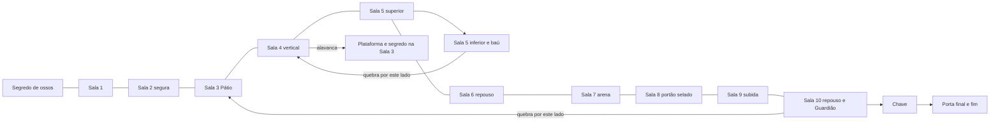

# Redesenho do Cemitério — registro de implementação

## Fontes e precedência

Fonte: pedido de 20/09/2026 e imagens 1°–12° em Downloads/anexos. O texto atualizado determina duas ondas de 2 e 3 inimigos (a anotação 3/4 na imagem 9 não prevalece).

| Recortes | Reconstrução |
|---|---|
| 1 | Cela e câmara de ossos no mesmo ID; início da Sala 2 apenas como sobreposição. |
| 2 | Sala 2 completa: duas plataformas, piso irregular, passagem em cada ponta. |
| 3 + 4 | Pátio único, segredo superior esquerdo, reentrância inferior, plataformas direitas, descida para Sala 4 e atalho para Sala 10. |
| 5 | Sala 4 vertical, duas câmaras à direita e duas conexões distintas com Sala 5. |
| 6 + 7 | Sala 5 única: percurso superior, queda à direita, baú e retorno inferior até a parede à esquerda da Sala 4. Sobreposição não duplica plataformas. |
| 8 | Sala 6 alongada, repouso no começo, três apoios centrais e subida final. |
| 9 | Duas salas: arena à direita (7), galeria com portão selado à esquerda (8). |
| 10 | Sala 9 percorrida da direita para a esquerda, seguida do poço de subida. |
| 11 + 12 | Sala 10 única: retorno à Sala 3 à esquerda, chegada da Sala 9, repouso, arena, porta com chave e subida final. |

Os contornos foram transcritos em coordenadas explícitas no módulo cemetery.js, usando uma grade de colisão de 8 unidades. Isso é precisão da geometria, não mudança de escala de personagens: dimensões físicas, zoom 1,5 e buffer 960×540 permanecem. A transcrição é uma adaptação jogável dos recortes, não extração vetorial exata do Dungeon Scrawl. Os recortes têm escalas de captura diferentes.

Apoios locais acrescentados para compatibilidade com o salto existente: acesso de retorno no lado direito da Sala 3, ligação sobre a reentrância central, degraus intermediários da Sala 4, patamares de chegada das subidas e apoios de entrada do poço da Sala 9. A Sala 5 mantém percurso e queda de mão única. Plataformas com inimigos usam superfície sólida, porque a IA existente não utiliza colisão com plataformas de mão única; sua IA não foi alterada.

## Grafo

## Reuso e extensão

Player, AI de inimigos, Guardião, energia, saúde, sprites de atores, câmera e pipeline são reaproveitados. CemeteryEvents concentra apenas os novos eventos de cenário. RoomManager continua atualizando entidades da sala ativa. As portas compartilham a mesma implementação e usam o ponto de passagem como threshold físico. O início do boss ocorre apenas após entrar na região da arena; repouso fica fora dela.

Fragmentos de osso são separados de fragmentos de vida. O baú usa 40 fragmentos provisoriamente: não há escudo funcional nem sistema novo de equipamento. Pilhas exigem quatro impactos reais, independentemente do dano de M1/M2.

## Validação inicial

- Dez IDs principais, com o segredo inicial embutido na Sala 1.
- Testes da física real avaliam movimento, corrida, saltos curtos/longos e descida de plataformas para construir o grafo de superfícies alcançáveis.
- Sala 3: patamar superior inalcançável antes; segredo alcançável após alavanca e parede aberta.
- Testes de portas verificam ausência de disparo por mera proximidade, cruzamento, destino, direção e ausência de spawn dentro de parede.
- Ondas 2/3, paredes direcionais, pilha de quatro impactos e persistência após respawn cobertos.
- Primeira travessia com inputs comuns: 260,3 segundos e uma morte; arena, boss, chave, porta e fim atingidos. Não houve alteração de vida, energia, posição ou habilidades pelo controlador.

A validação completa e os resultados visuais serão registrados após integração artística.
