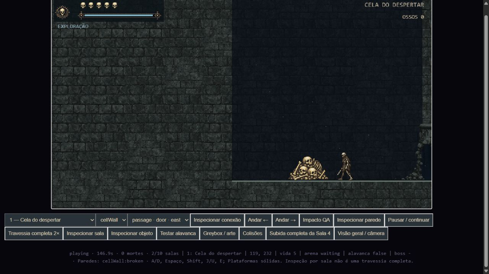
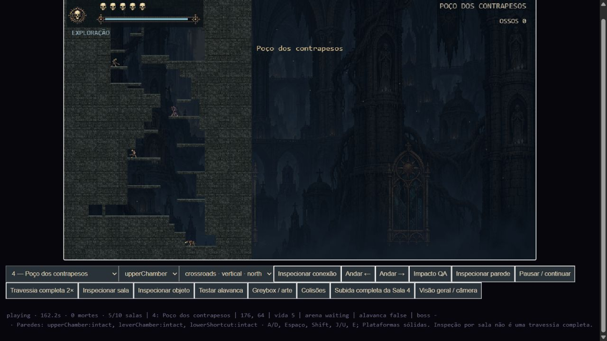
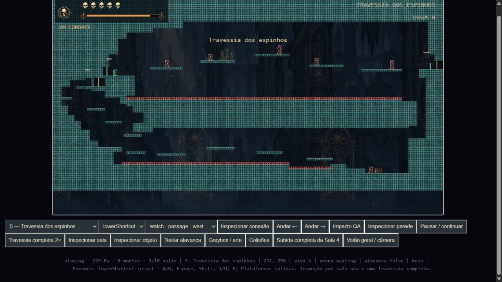
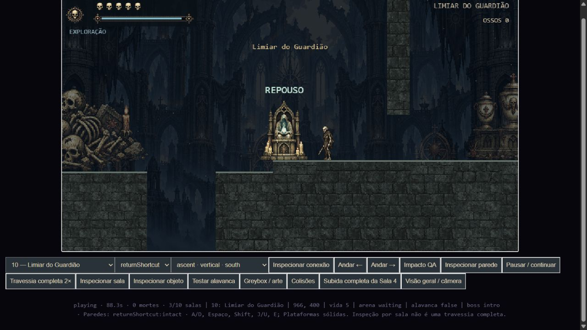
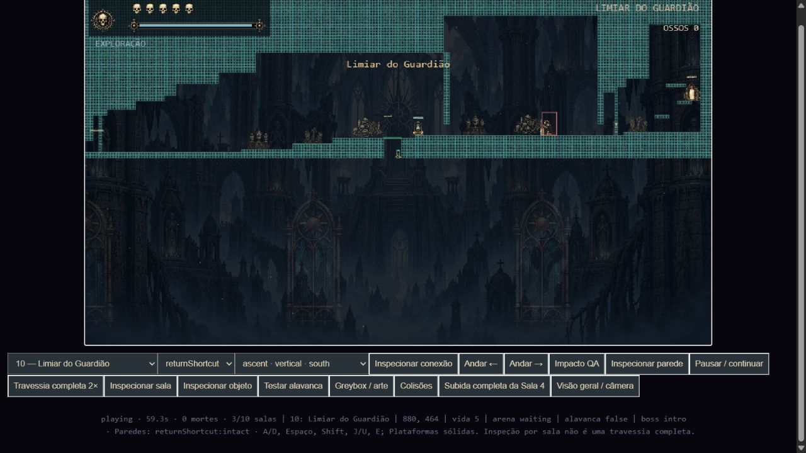
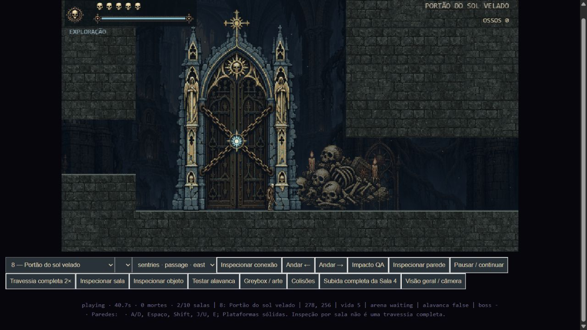
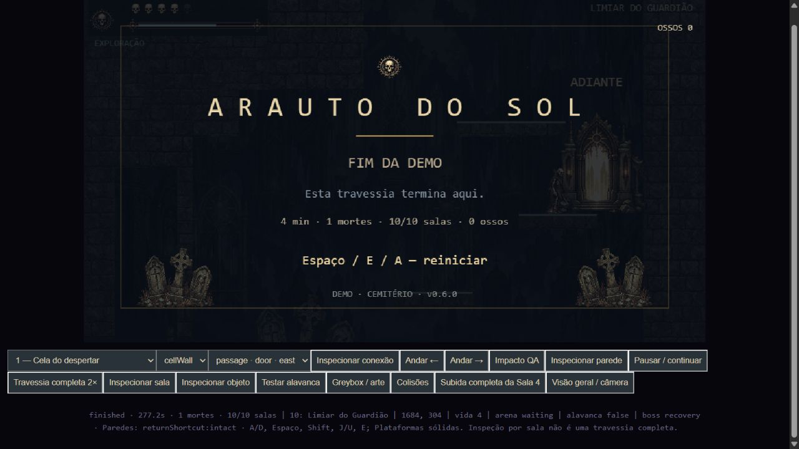

# Revisão estrutural do Cemitério

Revisão de 28/09/2026. As capturas repetidas foram consideradas uma única evidência: 10/11, 14/15 e 21/22 da lista enviada. A numeração abaixo segue os tópicos do texto da tarefa, que não coincide integralmente com os 22 arquivos.

As dez salas, os tipos e as quantidades de inimigos, os sprites aprovados e os parâmetros de movimento, combate e boss foram mantidos. Foram alteradas a geometria local, as chegadas, os eventos de passagem e a apresentação. As posições de quatro inimigos da Sala 4 acompanham os novos pisos. A Sala de testes continua disponível pelo link no rodapé.

| Anexo da tarefa | Correção aplicada | Verificação |
|---|---|---|
| 1 | A parede da cela abre um corredor. A câmera mantém o segredo fora do enquadramento inicial; sair inteiramente pela abertura aciona uma transição com fade. O retorno funciona da mesma forma. | Quebra por ataques; passagem nos dois sentidos. O segredo continua na mesma sala técnica, preservando o total de dez salas. |
| 2–3 | As saídas abertas entre Salas 2 e 3 têm corredor real, piso e espaço de passagem. A câmera para na boca; a troca ocorre 24 unidades depois, além da extensão do sprite. | Caminhada normal em ambos os sentidos e chegada sem sobreposição de colisão. |
| 4 | Pilha de ossos no rebaixo da Sala 3, reutilizando o objeto existente. | Quatro acertos, 12 unidades de moeda; não concede vida. |
| 5 | Parede secreta 3↔10 restrita à coluna de colisão. A parte superior permanece sólida após a quebra. A chegada da Sala 4 fica sobre o apoio, evitando o espaço estreito abaixo dele. | Ataques do lado 3 não abrem; abertura pelo lado 10, retorno, recarga de sala e respawn. |
| 6–7 | Apoios da Sala 4 distribuídos entre as paredes, com larguras variadas e vãos de descida. Um pequeno prolongamento da alvenaria ancora o apoio superior; o patamar da câmara lateral permite contorná-lo. O apoio suspenso inferior foi retirado. | Subida inteira desde a entrada inferior até a Sala 3, com 24 saltos normais. Rotas das duas câmaras laterais e retorno verificadas na malha de colisão. |
| 8 | Passagem principal 4↔5 aberta, com piso contínuo, espaço para o corpo e transição após a saída visual. | Travessia e retorno físico, além das rotas completas de cada sala. |
| 9 | O recuo seguro indevido à esquerda da faixa superior foi fechado com terreno. Os espinhos começam na coluna 34 e cobrem a região; sua base visual usa a parte inferior correta da textura. | Células perigosas sobre piso sólido, hitbox de uma célula sem ampliação; percurso principal e rota inferior continuam possíveis. |
| 10–11 | Atalho 5↔4 elevado: aproximação pela escadaria do corredor inferior da Sala 5, abertura para o patamar esquerdo da Sala 4, acima da saída principal. | Rota desde o baú até o atalho, abertura pelo lado 5 e ida/volta. O estado permanece após repouso e respawn. |
| 12 | Poço final da Sala 6 com apoios sólidos alternados nas paredes. Sala 7 mantém seu desenho e recebe plataformas sólidas. Sala 8 ganha afastamento e deslocamento vertical graduais de câmera perto do portão. | Subida e descida 6↔7; arena completa; zoom local volta ao normal ao afastar-se e mantém o controle do personagem. |
| 13 | Poço da Sala 9 com apoios sólidos alternados, espaço lateral para contornar cada apoio e chegar ao topo. | Rota completa para o boss e retorno até a Sala 8; travessia vertical 9↔10. |
| 14 | Barra de vida do boss depende do início efetivo do encontro. | Ausente no repouso e na exploração anterior à arena; encontro e fechamento começam após cruzar o gatilho. |
| 15 | Passagem secreta 10↔3 preservada como ligação oeste da Sala 10 / leste da Sala 3, anterior à arena e conectada ao circuito de retorno. | Só abre pelo lado 10, permanece aberta e permite retorno normal. É uma conexão entre salas com coordenadas locais, não um mapa contínuo de coordenadas globais. |
| 16–18 | Entradas estreitas da arena, sob alvenaria permanente. Grades de 16×32 fecham apenas os vãos, atrás do personagem. O poço de retorno anterior ao boss permanece acessível. | Entrada, bloqueio, morte e retorno ao repouso pré-boss; vitória e liberação. Retorno completo 10→9 sem iniciar o combate. |
| 19 | Colunas, lintéis e abertura do boss alinhados à grade de oito unidades. Desenho de desgaste dos apoios fica dentro de sua espessura sólida. | Inspeção da sobreposição de colisões e teste das aberturas. |
| 20 | Porta final e parede superior têm estados separados. A antiga cobertura visual que desaparecia por inteiro foi removida; o vão abre mantendo a coluna superior. | Comparação das células acima da porta antes/depois e percurso até o portal final. |

Todas as plataformas da demo, incluindo elevador e arena, são sólidas. Não há plataformas atravessáveis na grade do Cemitério; a descida usa as bordas. A instrução de descer atravessando plataformas foi retirada da interface. As rotinas genéricas de física para outros cenários não precisaram ser alteradas.

## Validação e limites da evidência

- `npm test`: suíte completa aprovada, incluindo a nova revisão estrutural.
- Percurso integral automatizado com comandos normais: **277,22 segundos, uma morte, dez salas visitadas, boss derrotado, chave e porta final liberadas**. A morte não foi ocultada e não houve alteração artificial de vida durante o percurso.
- Nove rotas inversas, 2→1 até 10→9: verificadas separadamente, com inimigos ativos e controles normais. Cada ensaio começa na chegada correspondente; não representa uma única partida de backtracking contínuo.
- Atalhos 5↔4 e 10↔3: testes de abertura por combate, travessia, retorno e persistência. Segredo superior da Sala 3 e rota do baú inferior também passaram.
- Percurso integral no navegador também concluído: **277,2 s, uma morte, 10/10 salas**, sem erros de console registrados.
- Inspeção visual no navegador: Sala 4, geometria e colisões da Sala 5, pré-boss sem barra, geometria da arena e câmera do portão. O botão **Colisões** na página de revisão e o F1 no jogo mostram terreno sólido, zonas perigosas e corpos.
- As verificações de rota não substituem uma avaliação humana de conforto dos saltos. As dimensões locais foram ajustadas para apoios sólidos; não se afirma reprodução pixel a pixel do desenho de referência.

Evidência textual: [suíte completa](suite-final.txt), [revisão estrutural](structural-final.txt) e [resultado do percurso](../level-redesign/playthrough.json).

## Capturas

