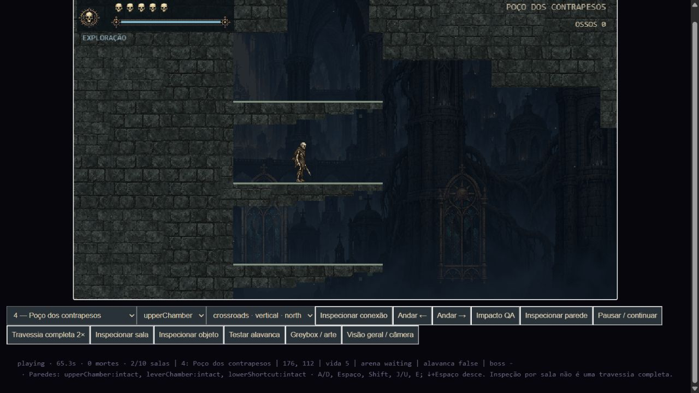
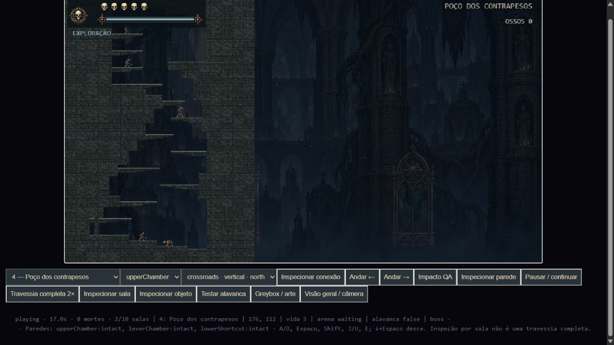
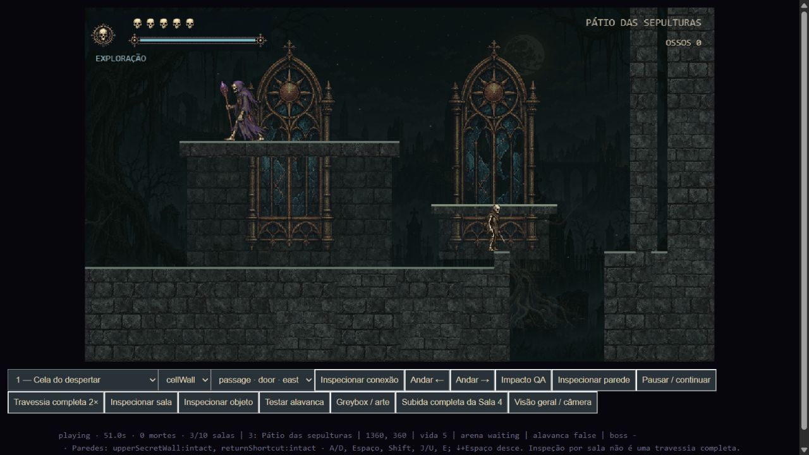
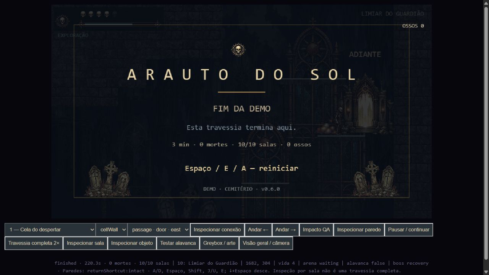

# Sala 4 e passagens secretas — correção

28/09/2026

## Sala 4

As 13 plataformas agora partem das paredes laterais. As grandes janelas/pilares decorativos sob os apoios foram substituídas, somente nesta sala, por pequenas mísulas de pedra em degraus, com pontas quebradas. Reutilizam o material de pedra existente.

Foram preservados o contorno da sala, as 13 alturas dos apoios, as câmaras laterais, os quatro inimigos e todas as conexões do greybox. Os comprimentos e posições horizontais dos apoios foram adaptados às paredes (64–120 unidades de mundo). O apoio na linha 62 passou de sólido a atravessável por baixo, como a maioria dos demais: sua face inferior dificultava a subida. Não houve alteração da física do pulo, habilidades, combate, sprites ou zoom.

O teste iniciou na entrada inferior e subiu até a Sala 3 com 18 saltos normais, nenhuma habilidade especial habilitada e sem alterar posição, vida ou energia durante o percurso. A inspeção no navegador também confirmou a chegada à Sala 3 com cinco caveiras e zero mortes. A descida integra o percurso completo; um teste separado verifica a saída da saliência anteriormente bloqueada. As duas câmaras laterais continuam acessíveis e têm caminho de retorno.

## Auditoria das paredes

| Parede | Classificação | Após a quebra |
|---|---|---|
| `cellWall`, Sala 1 | Local: cela e segredo pertencem ao mesmo room | Abertura física para caminhar até o segredo, sem troca artificial de room |
| `upperSecretWall`, Sala 3 | Local, exige a alavanca da Sala 4 | Acesso ao nicho de moedas |
| `upperChamber`, Sala 4 | Local | Acesso à câmara de ossos |
| `leverChamber`, Sala 4 | Local | Acesso à alavanca |
| `lowerShortcut`, Salas 5 ↔ 4 | Entre rooms, quebra permitida pela Sala 5 | Abertura persistente e transição normal nos dois sentidos |
| `returnShortcut`, Salas 10 ↔ 3 | Entre rooms, quebra permitida pela Sala 10 | Abertura persistente e transição normal nos dois sentidos |

Montes de ossos são objetos coletáveis destrutíveis, não paredes entre salas. A porta final continua dependente da chave do Guardião.

As conexões entre rooms já estavam cadastradas. A correção alinhou o disparo da transição ao centro da parede de oito unidades e exige que o corpo esteja dentro da abertura visível de 32 unidades. A passagem continua usando `RoomManager.travel`, com o mesmo processo de troca e chegada das outras conexões.

Foi corrigida uma chegada insegura no retorno 10 → 3: antes, o jogador aparecia dentro do poço vertical vizinho e podia cair durante a proteção de chegada. Agora aparece sobre a borda com apoio. A chegada 4 → 5 pelo atalho inferior também foi ajustada para piso válido. As flags de quebra compartilhadas continuam removendo a parede dos dois lados ao recarregar salas; repouso e reaparecimento não as restauram durante a run.

## Testes e evidências

- `npm test`: bateria completa aprovada. Registro: `tests.txt`.
- Sala 4: subida inferior → Sala 3, 18 saltos normais; descida e acessos laterais aprovados.
- Sala 1: bloqueio intacto, destruição com ataques normais e travessia física do segredo aprovados.
- Sala 10 ↔ 3: bloqueio antes da quebra, ataques pelo lado correto, rejeição pelo lado proibido, travessia nos dois sentidos, chegada estável e persistência após recarregar/reaparecer aprovados.
- Sala 5 ↔ 4: destruição com ataques normais, ida e volta, chegadas sobre piso e persistência após repouso/reaparecimento aprovadas. Registro adicional: `focused-tests.txt`.
- Nicho da Sala 3: alcançado e coletado com comandos normais em 25,0 segundos no teste específico, sem mortes.
- Percurso completo: 10 salas, Guardião e fim da demo em 220,3 segundos simulados, zero mortes. Repetido com renderização no navegador em 2×, com o mesmo resultado.
- Testes de proteção confirmam física, combate, IA, energia, escalas, câmera e animações aprovadas sem alterações.
- Auditoria de geometria compara com `cemetery-before.js`: mudanças limitadas aos apoios da Sala 4 e chegadas dos atalhos; contornos, alturas, encontros e topologia preservados.

Os controladores dos testes foram ajustados para evitar ataques fora de alcance, recuperar corrida após pausas de energia e iniciar o salto do nicho da Sala 3 quatro unidades mais perto da borda. São mudanças apenas na condução automatizada dos testes, sem mudanças nos controles ou regras do jogo. O teste de subida também está disponível pelo botão “Subida completa da Sala 4” na página de revisão.

A validação demonstra travessias reproduzíveis e inspeção visual; não substitui a avaliação humana do conforto dos saltos.
